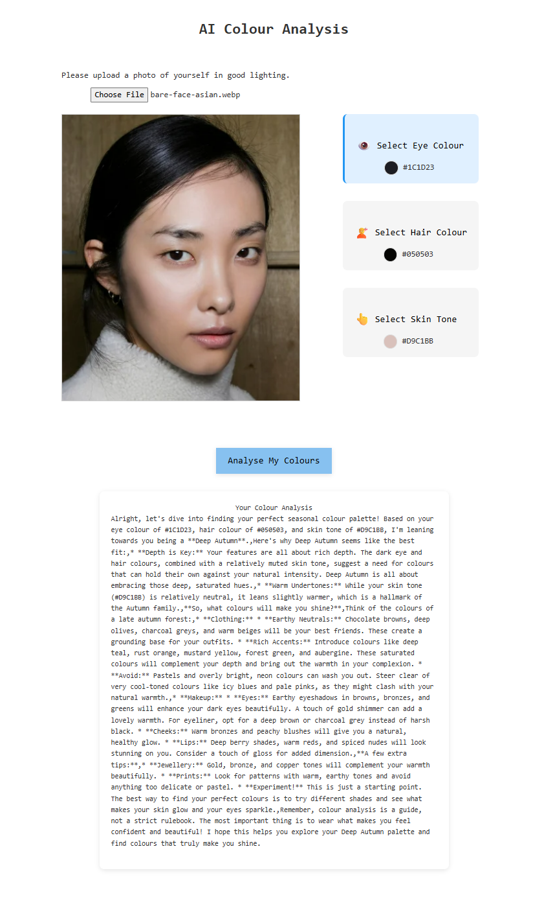

# Colour Analysis App

## Overview

The Colour Analysis App is a simple web application that allows users to take a picture and analyse the colors of their eyes, hair, and skin. The app extracts the color hex codes from the image and provides a detailed color analysis using a language model [at the moment using gemini-2.0-flash].

## Demo

MVP 1:

- Super basic UI
- Allowed to upload a picture and from there 1st click is the eyes, 2nd click is colour of hair and 3rd click is colour of skin (very limited)
- Basic functionality allows collection of hex codes to generate colour analysis

MVP 2:

- Added a crosshair cursor over the picture for more accurate colour selection
- Changed up display to make more compact
- No longer limited to 1st click eye etc. you can click on which feature you are selecting colours for and then adjust colour until satisfied
- Hex code and colour swatch displayed
- Changed font for different vibe
