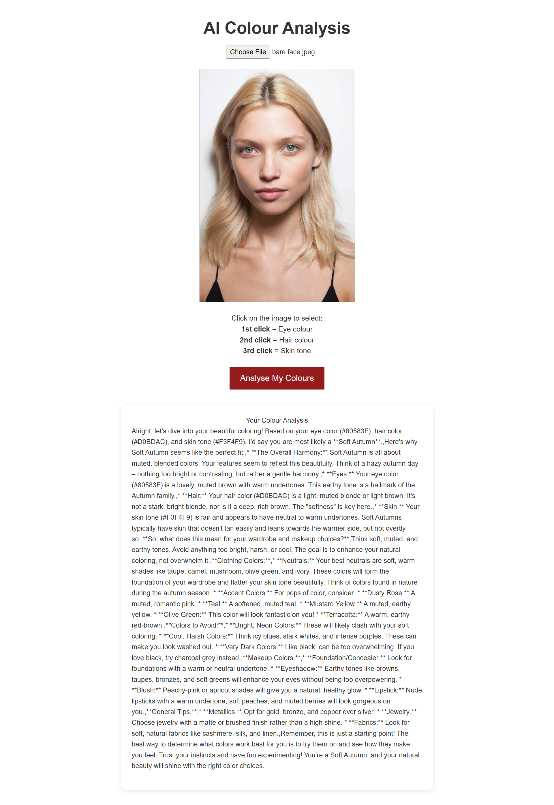

# ColoUr Analysis App

## Overview

The ColoUr Analysis App is a simple web application that allows users to take a picture and analyse the colors of their eyes, hair, and skin. The app extracts the color hex codes from the image and provides a detailed color analysis using a language model.

## Demo

MVP 1:

